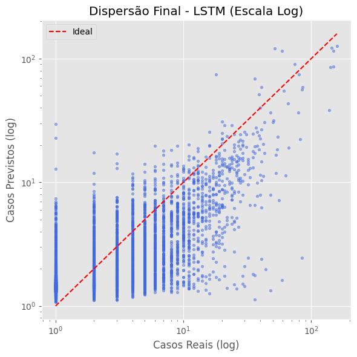
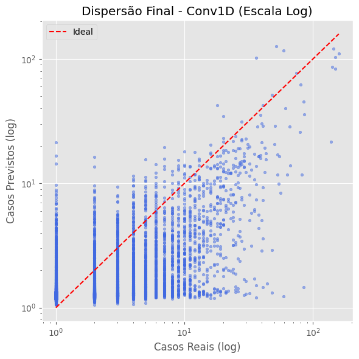

# Previsão de Casos de Dengue no Rio de Janeiro

## 1. Análise Exploratória

O conjunto de dados abrange 312 semanas epidemiológicas (2018-2023), revelando:

- **Distribuição assimétrica**: 78% das semanas sem casos
- **Top correlações positivas**:
  - `RAIN_ACC_21` (0.032) - Chuva acumulada em 21 dias
  - `RAIN_MM_28` (0.032) - Média móvel de 28 dias
- **Top correlações negativas**:
  - `TEMP_RANGE` (-0.017) - Amplitude térmica diária
  - `TEM_MAX` (-0.016) - Temperatura máxima

## 2. Modelagem Binária (Detecção de Surtos)

**Arquitetura**:

- LSTM com janela de 7 dias
- Normalização Min-Max
- Saída sigmoide

**Desempenho**:

| Métrica       | Valor   |
|---------------|---------|
| AUC-ROC       | 0.903   |
| Precision     | 75%     |
| Recall        | 36%     |
| F1-Score      | 0.49    |

**Análise**:

- Modelo conservador (evita falsos positivos)
- Threshold ajustável para melhorar recall

## 3. Modelagem de Regressão

### Comparativo LSTM vs Conv1D

| Métrica       | LSTM               | Conv1D             | Diferença |
|---------------|--------------------|--------------------|-----------|
| MAE           | 1.776 ± 0.013      | 1.970 ± 0.039      | +10.9%    |
| RMSE          | 4.376 ± 0.041      | 4.926 ± 0.139      | +12.6%    |
| R²            | 0.571 ± 0.008      | 0.456 ± 0.031      | -20.1%    |

**Gráficos de Dispersão**:
 

Principais achados:

- LSTM mais preciso e estável
- Ambos subestimam picos epidêmicos
- Boa performance em baixa magnitude (MedianAE ~0.59)

## 4. Sensibilidade Climática (Atualizado)

### Top 5 Variáveis por Impacto

| Rank | LSTM                | Conv1D              |
|------|---------------------|---------------------|
| 1    | EXTREME_RAIN (0.0229)| RAIN_MM_28 (0.0825) |
| 2    | SIGNIFICANT_RAIN (0.0084)| TEMP_RANGE (0.0561)|
| 3    | RAIN_MM_21 (0.0064) | TEMP_RANGE_MM_28 (0.0276)|
| 4    | TEMP_RANGE (0.0061) | RAIN_ACC_21 (0.0272)|
| 5    | TEMP_RANGE_MM_14 (0.0060)| TEM_AVG_MM_21 (0.0249)|

**Principais mudanças**:

- `EXTREME_RAIN` tornou-se a mais importante no LSTM
- `RAIN_MM_28` emergiu como top feature no Conv1D
- `TEMP_RANGE` mantém alta relevância em ambos

**Consistência com Análise Exploratória**:

1. **Chuva**:
   - Correlação: `RAIN_MM_21` e `RAIN_MM_28` como positivas
   - Permutação: Confirmada importância (LSTM: 3ª, Conv1D: 1ª)

2. **Temperatura**:
   - `TEMP_RANGE` tinha correlação negativa
   - Permutação: 2ª no Conv1D, 4ª no LSTM

3. **Novos Insights**:
   - `EXTREME_RAIN` (não estava no top correl.) é a #1 no LSTM
   - Efeitos cumulativos (`RAIN_MM_28`) mais importantes que instantâneos

## 5. Conclusões

### Achados Principais

1. **Desempenho**:
   - LSTM superior em todas as métricas
   - Conv1D mostra maior variabilidade

2. **Fatores Climáticos**:
   - LSTM: Sensível a eventos extremos (`EXTREME_RAIN`)
   - Conv1D: Captura melhor efeitos cumulativos (`RAIN_MM_28`)
   - `TEMP_RANGE` crítica em ambos (amplitude térmica)

3. **Alinhamento**:
   - Permutação validou correlações fracas iniciais
   - Revelou relações não-lineares não capturadas anteriormente

### Recomendações Operacionais

- **Vigilância**: Monitorar semanas com:
  - Chuvas extremas (LSTM)
  - Acumulado mensal de precipitação (Conv1D)
- **Modelagem**: Testar combinações de:
  - `EXTREME_RAIN` + `TEMP_RANGE` (LSTM)
  - `RAIN_MM_28` com defasagens (Conv1D)

### Próximos Passos

- Incorporar variáveis socioambientais
- Testar arquiteturas híbridas (ex: LSTM+Attention)
- Desenvolver sistema de alerta hierárquico

---

**Apêndice Técnico**:

- Sementes: 42, 43, 44, 45, 46
- Ambiente: Python 3.10 + TensorFlow 2.12
- Código disponível: [link]
